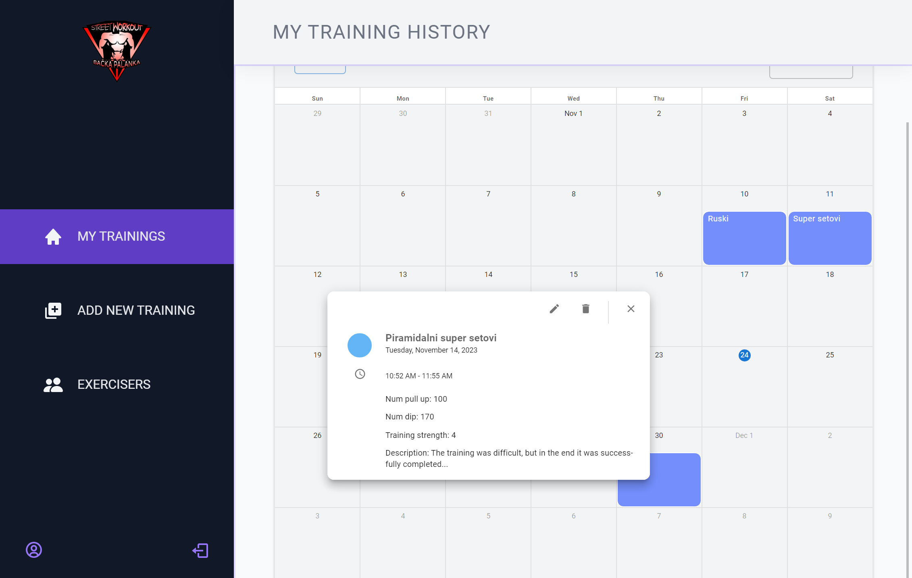

# Streetworkout-Training-History

The goal of this app is to allow authenticated users to add, edit, or delete past trainings, facilitating a long-term review of their training progress.

You can view the project live here:
[Streetworkout-Training-History](https://streetworkout-training-history.netlify.app)

---

### Table of Contents

- [Description](#description)
- [Getting Started](#getting-started)
- [References](#references)

---

## Description

#### Authentication:

- Application users are street workout enthusiasts. They must log in to use the app.
- New users must sign up.
- Users should be able to upload avatars, change their names, and passwords.

#### Trainees (Exercisers):

- A logged-in user should be able to view and read all users and see their names and avatars.
- Users should be able to view details of each user.
- Users should be able to see details of each selected user's workout (without the ability to edit others' data).

#### Trainings:

- Contains a history of workouts, their execution date, the number of repetitions, and a difficulty rating (1 to 5). Provides an overview of all trainings and other details.
- Allows to authenticated user the addition of a new workout (trainings/new), updating or deleting training.

#### Training:

- Displays details of an individual workout based on the ID, including the number of pull-ups, dips, push-ups, and a description of the entire workout.
- Provides the ability to edit and delete workouts.

#### Technologies

- React
- Supabase
- Styled Components
- React Query
- React Router
- React Hook Form
- React Scheduler

[Back To The Top](#streetworkout-training-history)

---

## Getting Started

To start the project, it is necessary to download the files from the github repository and after that run this commands:
 `'npm i'`   `'npm run dev'`

[Back To The Top](#streetworkout-training-history)

---

## References

- This is React-Scheduler Library through which I displayed the calendar: [React-Scheduler Library](https://devexpress.github.io/devextreme-reactive/react/scheduler/docs/guides/getting-started/)

[Back To The Top](#streetworkout-training-history)
